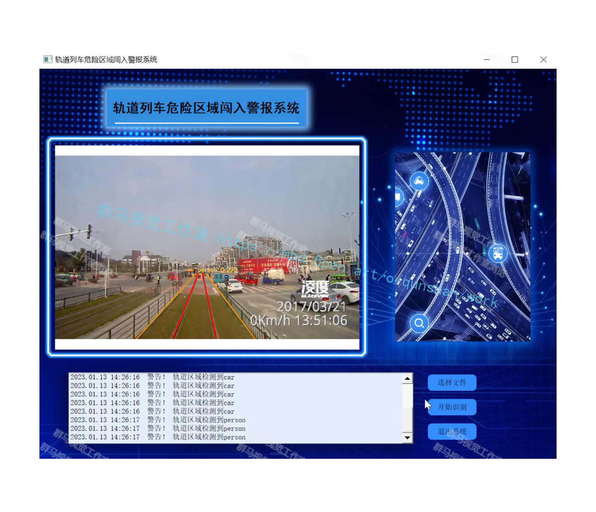
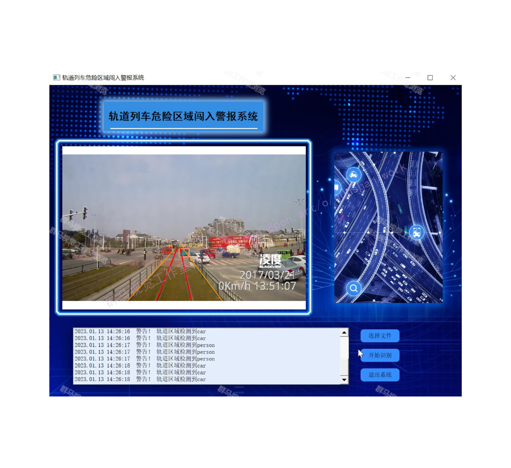
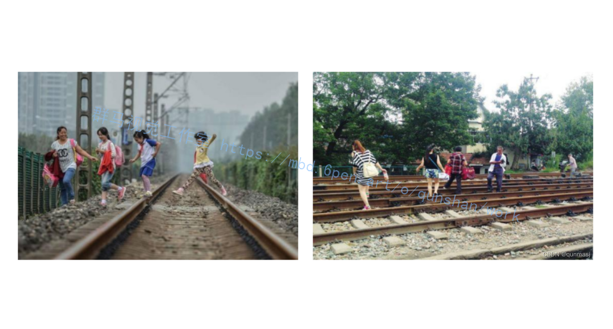
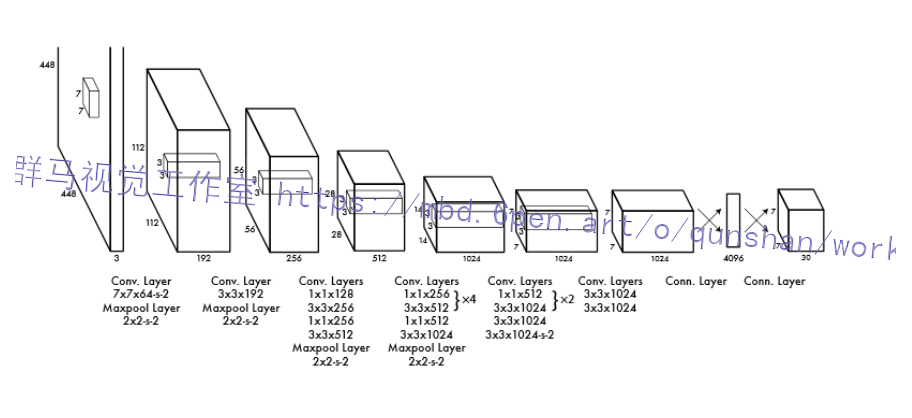
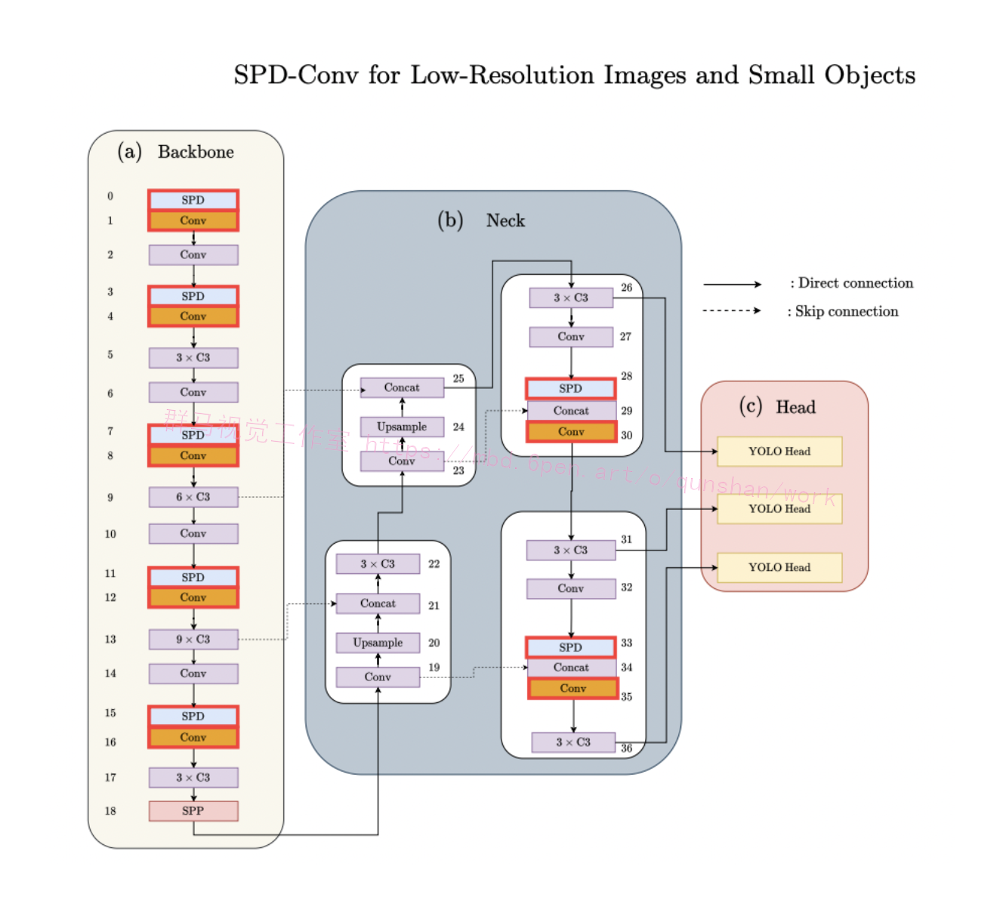
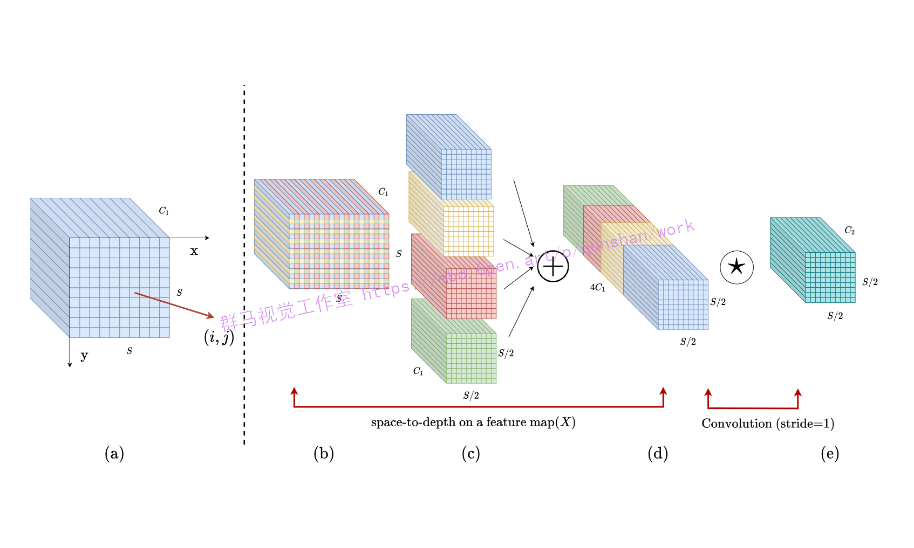
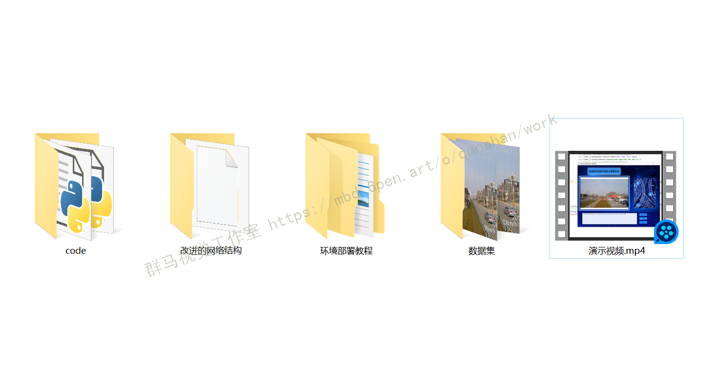

# 1.研究背景
高速铁路的发展带来了巨大的便利，铁路事业高速发展的同时，铁路安全问题也值得关注。国内现有的铁路安全，主要是依靠视频监控和人工巡检相结合的方法。由于中国的铁路轨道错综复杂，分布广泛，列车具有较高的行驶速度，同时工作人员存在缺乏专业素养、操作不当，疏忽大意等现象。而我国的铁路网规模较大，很难通过人工检测的方法判断所有线路是否有行人非法闯入和逗留。因此，为提高铁路安全性、可靠性，同时节省人力成本，轨道视频监控系统迫切需要全面的技术升级和大规模应用。而传统的算法常常存在实时性较差，精度不高等问题。　


# 2.图片演示




# 3.视频演示
[改进YOLOv7的轨道列车危险区域闯入警报系统（系统＆源码）_哔哩哔哩_bilibili](https://www.bilibili.com/video/BV1DA411Z7JW/?vd_source=bc9aec86d164b67a7004b996143742dc)

# 4.国内外研究现状
近年来，世界高铁技术的发展和广泛应用，使得铁路交通安全问题不止是我国的难题，而是世界性的难题，尤其是以欧洲、美国、日本为首的铁路技术先进的发达国家。各国家对铁路安全问题的重视程度也在不断提高，用于铁路安全方面的财力、物力、人力也在逐年上涨。随着城市现代化，智能化的建设，各个国家目前为止在铁路安全方面也在寻求技术上的突破和根本上的革新。发达国家纷纷构建铁路智能运输系统(Railway Intelligent Transportation System）为基础的铁路运营保障体系。铁路安全朝向智能化，高效化的发展成为了必然趋势。
日本作为中国的近邻，亚洲的发达国家，也是世界上最早建成实用高铁并进行商业运营的国家，其在高铁安全方向的体系建设和技术支持也值得我们参考和学习。日本国土虽然面积不大，但是属于岛国，地形复杂，且属于地震带，为地震多发区，但是日本的高速铁路“新干线”却以安全而世界闻名，自从其在1964年建成至今从未发生过重大旅客安全事故。因此，日本的铁路安全技术值得我们学习和研究。日本采用的异物检测技术主要为分布式光缆监控技术15]，其由若干个传感器所组成，当光缆发出信号，经过区域节点向外传播，信号在传播过程中发生衰减，最后，衰减的信号通过光缆返回至光源，当检测区域存在异物时，信号衰减幅度会发生改变，最终通过返回信号的衰减幅度来判断是否存在异物。倘若存在异物时，系统还会针对异物的危害程度进行评估，当达到一定标准时，系统会立刻报警，并且控制列车行驶速度，避免发生灾害，保障铁路安全。
美国广阔的国土面积和网遍布全国的铁路网络均与中国的铁路状况具有高度的相似性。而美国对于铁路安全问题也拥有比较好的应对措施，发达的经济和先进的科学技术为美国的交通安全提供了保障。因此，美国的铁路安全系统对我国的铁路安全建设也具有重要的参考价值。美国在铁路安全方面也是投入了相当大的成本，其将安全检测系统分割成了众多模块，由众多传感器组成。当存在异物侵限时，众多传感器会将感受的信息反馈给系统，系统会根据反馈信息进行融合计算，当判断存在安全隐患时，系统会自动将警报传达给监控室并且视频监控模块会调集该路段的视频监控，由人工来决定进一步的措施。



# 5.本文研究内容
本文提出一种基于改进YOLOv7网络的轨道危险区域障碍物检测方法，包括，拍摄获取列车前方轨道的视频信息，将视频中含有障碍物的关键部分截出，并筛选截出关键部分图片作为样本图像，用于建立铁路轨道危险区域障碍物检测的数据集；将获取的样本图像进行数据增强处理，并将得到的数据集划分为训练集和测试集；构建铁路轨道危险区域障碍物检测模型，特征提取网络模型制作好的训练集采用卷积神经网络进行训练，检测障碍物是否在轨道危险区域内，过判断是否重叠来检测危险区域内是否有障碍物。本发明能够实现对列车轨道危险区域障碍物的智能检测，准确率高，误检率低，检测速度快，实时性好，具有广阔的应用潜力。

# 6.YOLOv7算法
YOLO是You Only Look Once的缩写。YOLO 的网络结构和CNN类似，由卷积层、池化层和全连接层组成。但是与CNN不同的是，YOLO的输出层不再是Softmax函数，而是张量(Tensor）。从前面介绍的RCNN、FAST RCNN可以看出，rcnn、fast renn为了求取可能会包含物体的候选框，采用一种独立于网络之外的selective search方法分离模块，训练过程因此也是分成多个模块进行，把检测过程分为分类问题和回归问题两部分求解。而YOLO的这些步骤完全是在一个独立的网络中进行的。在求取候选区域的过程中，YOLO也将检测问题转化成了回归问题去解决。由于YOLO的模型是一个单独的end-to-end 网络，网络经过一次输入图像就能够检测出物体的位置和物体所属的类别。


# 7.YOLOv7算法改进
卷积神经网络 (CNN) 在许多计算机视觉任务（例如图像分类和对象检测）中取得了巨大成功。然而，它们的性能在图像分辨率低或物体很小的更艰巨的任务中迅速下降。在本文中，[该博客指出，现有 CNN 架构中存在缺陷设计，即使用跨步卷积和/或池化层，这会导致细粒度信息的丢失和对不太有效的特征表示的学习](https://mbd.pub/o/bread/Y56VlJtp)。为此，我们提出了一个名为SPD-Conv的新 CNN 构建块来代替每个跨步卷积层和每个池化层（因此完全消除了它们）。SPD-Conv 由空间到深度(SPD) 层后跟非跨步卷积 (Conv) 层，可以应用于大多数（如果不是全部）CNN 架构。我们在两个最具代表性的计算机视觉任务下解释了这种新设计：对象检测和图像分类。然后，我们通过将 SPD-Conv 应用于 YOLOv5 和 ResNet 来创建新的 CNN 架构，并通过经验证明我们的方法明显优于最先进的深度学习模型，尤其是在具有低分辨率图像和小物体的更艰巨任务上。

#### 模块结构


#### 空间到深度 （SPD）
[该博客推广了一种（原始）图像转换SPD组件，以对CNN内部和整个CNN的特征图进行下采样](https://afdian.net/item?plan_id=0abc03a0931311edac7f5254001e7c00)，如下所示。
考虑大小为 S×S×C1 的任何中间特征图 X，将一系列子特征图切成
f0,0=X[0:S:scale，:0S:s cale]，f1,0=X[1: S cale，0:S::SCALE]，...，
fscale−1,0=X[scale−1: S s c ale，0:S:: s cale];
f0,1=X[0:S:scale，:1S:cale]，f1,1，...，
fscale−1,1=X[scale−1: S s c ale，1:S:: s cale];
f0,scale−1⋮ =X[0:S: s c a l e，scal e−1:S:SCALE]，，f1,scale−1...，
fscale−1,scale−1=X[scale−1:S: s c a l e，scal e−1:S:cale]。
通常，给定任何（原始）特征映射 X，子映射fx,y由所有条目 X（i，j） 形成 i+x 和 j+y 可被 scale 整除.因此，每个子映射将 X 的样本下采样 scale 的因子。图 [4](https://deepai.org/publication/no-more-strided-convolutions-or-pooling-a-new-cnn-building-block-for-low-resolution-images-and-small-objects#S2.F4 "Figure 4 ‣ 2.2 Low-Resolution Image Classification ‣ 2 Preliminaries and Related Work ‣ No More Strided Convolutions or Pooling: A New CNN Building Block for Low-Resolution Images and Small Objects")（a）（b）（c） 给出了一个示例，当 scale=2 时，我们得到四个子映射f0,0，f1,0，，f0,1，f1,1每个形状均为 （S2，S2，C1） 并将 X 的采样率降低 2 倍。
接下来，我们沿通道维度连接这些子特征图，从而得到一个特征图X′，其空间维数缩小了scale 通道尺寸增加 ScaLe2 倍数。换句话说，SPD 将特征映射 X（S，S，）C1 转换为中间特征映射X′（Sscale，Sscalescale2C1）。
YOLOv5-SPD.我们将第 [3](https://deepai.org/publication/no-more-strided-convolutions-or-pooling-a-new-cnn-building-block-for-low-resolution-images-and-small-objects#S3 "3 A New Building Block: SPD-Conv ‣ No More Strided Convolutions or Pooling: A New CNN Building Block for Low-Resolution Images and Small Objects") 节中描述的方法应用于 YOLOv5 并获得 YOLOv5-SPD（图 [5](https://deepai.org/publication/no-more-strided-convolutions-or-pooling-a-new-cnn-building-block-for-low-resolution-images-and-small-objects#S4.F5 "Figure 5 ‣ 4.1 Object Detection ‣ 4 How to Use SPD-Conv: Case Studies ‣ No More Strided Convolutions or Pooling: A New CNN Building Block for Low-Resolution Images and Small Objects")），只需将 YOLOv5 跨步 2 卷积替换为我们的 SPD-Conv 构建块即可。这种替换有 7 个实例，因为 YOLOv5 在主干中使用了五个步幅 2 卷积层来对特征图25进行下采样，并在颈部使用两个步幅 2 卷积层。在 YOLOv5 颈部的每个跨步卷积之后都有一个连接层;这不会改变我们的方法，我们只是将其保持在SPD和Conv之间。

可扩展性。YOLOv5-SPD 可以通过与 YOLOv5 相同的方式轻松扩展和缩减来满足不同的应用程序或硬件需求。具体来说，我们可以简单地调整（1）每个非跨步卷积层中的滤波器数量和/或（2）C3模块的重复次数（如图[5](https://deepai.org/publication/no-more-strided-convolutions-or-pooling-a-new-cnn-building-block-for-low-resolution-images-and-small-objects#S4.F5 "Figure 5 ‣ 4.1 Object Detection ‣ 4 How to Use SPD-Conv: Case Studies ‣ No More Strided Convolutions or Pooling: A New CNN Building Block for Low-Resolution Images and Small Objects")所示），以获得不同版本的YOLOv5-SPD。第一种称为宽度缩放，它将原始宽度 nw （通道数）更改为 ⌈nw×width_factor⌉8（四舍五入到最接近的 8 的倍数）。第二个被称为深度缩放，它将原始深度 nd （重复 C3 模块的次数;例如，图 [5](https://deepai.org/publication/no-more-strided-convolutions-or-pooling-a-new-cnn-building-block-for-low-resolution-images-and-small-objects#S4.F5 "Figure 5 ‣ 4.1 Object Detection ‣ 4 How to Use SPD-Conv: Case Studies ‣ No More Strided Convolutions or Pooling: A New CNN Building Block for Low-Resolution Images and Small Objects") 中的 9×C3 中的 9）更改为⌈nd×dep t h_factor⌉. 这样，通过选择不同的宽度/深度因子，我们获得了纳米、小型、中型和大型版本的 YOLOv5-SPD，如表 [2](https://deepai.org/publication/no-more-strided-convolutions-or-pooling-a-new-cnn-building-block-for-low-resolution-images-and-small-objects#S4.T2 "Table 2 ‣ 4.1 Object Detection ‣ 4 How to Use SPD-Conv: Case Studies ‣ No More Strided Convolutions or Pooling: A New CNN Building Block for Low-Resolution Images and Small Objects") 所示， 其中因子值的选择与 YOLOv5 相同，以便在我们稍后的实验中进行比较。


# 8.核心代码实现
```
class space_to_depth(nn.Module):
    # Changing the dimension of the Tensor
    def __init__(self, dimension=1):
        super().__init__()
        self.d = dimension

    def forward(self, x):
         return torch.cat([x[..., ::2, ::2], x[..., 1::2, ::2], x[..., ::2, 1::2], x[..., 1::2, 1::2]], 1)
......
```

# 9.系统整合
下图[完整源码＆环境部署视频教程＆数据集＆自定义UI界面](https://s.xiaocichang.com/s/eabbe6)：

参考博客[《改进YOLOv7的轨道列车危险区域闯入警报系统（系统＆源码）》](https://mbd.pub/o/qunma/work)

# 10.参考文献
***
[1][苏松志](https://s.wanfangdata.com.cn/paper?q=%E4%BD%9C%E8%80%85:%22%E8%8B%8F%E6%9D%BE%E5%BF%97%22),[李绍滋](https://s.wanfangdata.com.cn/paper?q=%E4%BD%9C%E8%80%85:%22%E6%9D%8E%E7%BB%8D%E6%BB%8B%22),[陈淑媛](https://s.wanfangdata.com.cn/paper?q=%E4%BD%9C%E8%80%85:%22%E9%99%88%E6%B7%91%E5%AA%9B%22),等.[行人检测技术综述](https://d.wanfangdata.com.cn/periodical/dianzixb201204031)[J].[电子学报](https://sns.wanfangdata.com.cn/perio/dianzixb).2012,(4).DOI:[10.3969/j.issn.0372-2112.2012.04.031](http://dx.chinadoi.cn/10.3969/j.issn.0372-2112.2012.04.031).

[2][方莉](https://s.wanfangdata.com.cn/paper?q=%E4%BD%9C%E8%80%85:%22%E6%96%B9%E8%8E%89%22),[张萍](https://s.wanfangdata.com.cn/paper?q=%E4%BD%9C%E8%80%85:%22%E5%BC%A0%E8%90%8D%22).[经典图像去噪算法研究综述](https://d.wanfangdata.com.cn/periodical/gykzjsj201011034)[J].[工业控制计算机](https://sns.wanfangdata.com.cn/perio/gykzjsj).2010,(11).DOI:[10.3969/j.issn.1001-182X.2010.11.034](http://dx.chinadoi.cn/10.3969/j.issn.1001-182X.2010.11.034).

[3][贾慧星](https://s.wanfangdata.com.cn/paper?q=%E4%BD%9C%E8%80%85:%22%E8%B4%BE%E6%85%A7%E6%98%9F%22),[章毓晋](https://s.wanfangdata.com.cn/paper?q=%E4%BD%9C%E8%80%85:%22%E7%AB%A0%E6%AF%93%E6%99%8B%22).[车辆辅助驾驶系统中基于计算机视觉的行人检测研究综述](https://d.wanfangdata.com.cn/periodical/zdhxb200701015)[J].[自动化学报](https://sns.wanfangdata.com.cn/perio/zdhxb).2007,(1).

[4][王荣本](https://s.wanfangdata.com.cn/paper?q=%E4%BD%9C%E8%80%85:%22%E7%8E%8B%E8%8D%A3%E6%9C%AC%22),[赵一兵](https://s.wanfangdata.com.cn/paper?q=%E4%BD%9C%E8%80%85:%22%E8%B5%B5%E4%B8%80%E5%85%B5%22),[李琳辉](https://s.wanfangdata.com.cn/paper?q=%E4%BD%9C%E8%80%85:%22%E6%9D%8E%E7%90%B3%E8%BE%89%22),等.[智能车辆的障碍物检测研究方法综述](https://d.wanfangdata.com.cn/periodical/gljtkj200711025)[J].[公路交通科技](https://sns.wanfangdata.com.cn/perio/gljtkj).2007,(11).DOI:[10.3969/j.issn.1002-0268.2007.11.025](http://dx.chinadoi.cn/10.3969/j.issn.1002-0268.2007.11.025).

[5][吕敬钦](https://s.wanfangdata.com.cn/paper?q=%E4%BD%9C%E8%80%85:%22%E5%90%95%E6%95%AC%E9%92%A6%22).[视频行人检测及跟踪的关键技术研究](https://d.wanfangdata.com.cn/periodical/Y2335373)[J].上海交通大学.2013.

[6][王兴宝](https://s.wanfangdata.com.cn/paper?q=%E4%BD%9C%E8%80%85:%22%E7%8E%8B%E5%85%B4%E5%AE%9D%22).[复杂场景下多姿态行人检测与识别方法研究](https://d.wanfangdata.com.cn/periodical/Y2120818)[J].苏州大学.2012.DOI:[10.7666/d.y2120818](http://dx.chinadoi.cn/10.7666/d.y2120818).

[7][朱文佳](https://s.wanfangdata.com.cn/paper?q=%E4%BD%9C%E8%80%85:%22%E6%9C%B1%E6%96%87%E4%BD%B3%22).[基于机器学习的行人检测关键技术研究](https://d.wanfangdata.com.cn/thesis/D055496)[D].2008.

[8][范昕炜](https://s.wanfangdata.com.cn/paper?q=%E4%BD%9C%E8%80%85:%22%E8%8C%83%E6%98%95%E7%82%9C%22).[支持向量机算法的研究及其应用](https://d.wanfangdata.com.cn/periodical/Y512102)[J].浙江大学.2003.

[9][陈刚](https://s.wanfangdata.com.cn/paper?q=%E4%BD%9C%E8%80%85:%22%E9%99%88%E5%88%9A%22).基于多特征的行人检测方法研究[D].2012.


---
#### 如果您需要更详细的【源码和环境部署教程】，除了通过【系统整合】小节的链接获取之外，还可以通过邮箱以下途径获取:
#### 1.请先在GitHub上为该项目点赞（Star），编辑一封邮件，附上点赞的截图、项目的中文描述概述（About）以及您的用途需求，发送到我们的邮箱
#### sharecode@yeah.net
#### 2.我们收到邮件后会定期根据邮件的接收顺序将【完整源码和环境部署教程】发送到您的邮箱。
#### 【免责声明】本文来源于用户投稿，如果侵犯任何第三方的合法权益，可通过邮箱联系删除。